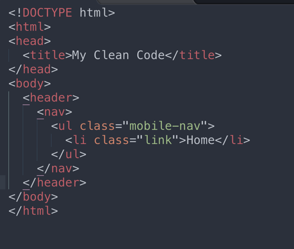
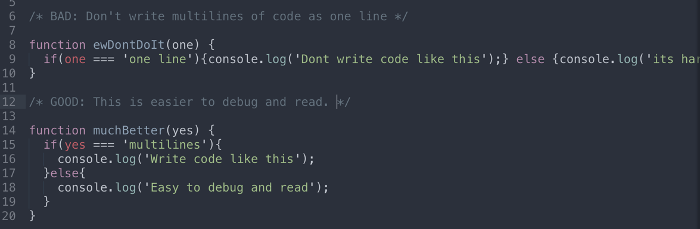
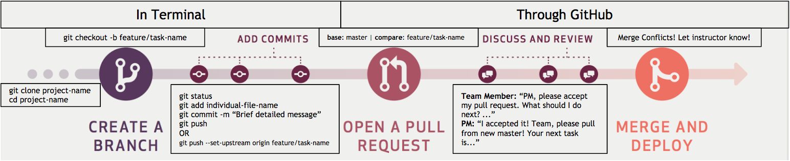

# focus-like-crazy
WHS Focus Like Crazy Final Project

Project Manager: Ian Acosta 
Developers: Ian Acosta, Jessica Lopez, Kelli McCrary, Kayla Diniega

<h3>Final Project Breakdown</h3>
<b>Assignments and Grading for the 4th quarter</b>
<ul>
  <li>Final project: Minimum of 6 commits a week and Pull request when a task is complete</li>
  <li>Quizzes: Take home quiz every other week</li>
  <li>Research assignments: Given every other week and turned in as a medium blog or Journal entry</li>
</ul>

<h3>Daily Scrum</h3>
<b>Teams will meet daily for the first 5-10 mins of class to report the following:</b>
<ul>
  <li>Progress on their task. What did team members accomplish in the previous class?</li>
  <li>What each team member is going to work for the current class period</li>
  <li>Any road blocks per task or clarifications they may need from other team memebers or instructors</li>
</ul>

<b>Project Manager reports daily to the instructors the following:</b>
<ul>
  <li>Progress per task that the group is currently working on</li>
  <li>Projection as to what will be accomplished by the end of the week</li>
  <li>Any road blocks per task or clarifications the team may need</li>
</ul>

<b>Developers are to notify the project manager and an instructor (in person or in Slack) when:</b>
<ul>
  <li>A task is complete</li>
  <li>A pull request is made</li>
</ul>

If there are questions about a task, code questions, road blocks (challenges) please notify an instructor via Slack.

<h3>Formatting Structure</h3>

<b>HTML, CSS, and Project Images</b>
<ul>
  <li>File, class and id names should be all lowercase with dashes for spacing (if needed).</li>
  <li>Any nesting must be properly tabbed, and every element should be returned as a new line.</li>
</ul>

<b>Javascript</b>
<ul>
  <li>Function names and variables should be camelcase.</li>
  <li>Any nesting must be properly tabbed. No one liners for multiple lines of code.</li>
  <li>Use block comment for each a task.</li>
  <li>Each Javascript task should have a block comment of psuedo code.</li>
</ul>

<b>Formatting example</b>

<b>Sublime Text</b>
<ul>
  <li>Set spaces: 2</li>
</ul>

<b>Git Flow</b>

<b>Github Commit Messages</b>
<ul>
  <li>What was completed, any current bugs.</li>
  <li>Example: ‘completed top navigation in html, links do not work yet’</li>
</ul>

<h2>Task Breakdown - Part 1</h2>

<b>Creating the Views</b>
<ul>
  <li>Follow the design views found under the Assets folder.</li>
  <li>If the view is not the home (first page/index.html), create a new file in the root folder with the view name.</li>
</ul>

<b>Adding CSS</b>
<ul>
  <li>All of the css will be in the css/styles.css</li>
  <li>Assign classes to reusable styles.</li>
  <li>Create a block comment if styles are for a specific view or user interaction, otherwise it's considered a general style.</li>
</ul>
<ul>
  <li><b>Colors</b><ul>
    <li>Blue: #4990E2</li>
    <li>Light Gray: #4990E2</li>
    <li>Medium Gray: #9B9B9B (font color)</li>
    <li>Dark Gray: #4A4A4A</li>
  </ul></li>
  <li><b>Fonts</b><ul>
    <li>Logo and Buttons: <a href="https://fonts.google.com/specimen/Chewy">Chewy</a></li>
    <li>Headings: <a href="https://fonts.google.com/specimen/Lato">Lato Black</a></li>
    <li>Body: <a href="https://fonts.google.com/specimen/Lato">Lato Regular</a></li>
  </ul></li>
</ul>

<b>User Interactions</b>
<ul>
  <li>All of the javascript will be in the js/app.js</li>
  <li>Start each task with a block comment and include your pseudo code.</li>
  <li>Create interactive buttons for the navigation</li>
  <li>Create array objects of mock data for tips and store them in a variable</li>
  <li>Randomly display 'tips' on Pause Page</li>
</ul>

<h2>Task Breakdown - part 2</h2>
<ul>
  <li>Create Game logic</li>
  <li>Add CSS(or image assets) for game UI</li>
  <li>Add progress bar logic to game UI</li>
  <li>Create timer</li>
  <li>Add Pause screen to Game UI as an overlay</li>
  <li>Make Pause screen 'appear' on timer increments</li>
  <li>Allow user to resume from Pause screen</li>
</ul>

<h2>After review: 4/14</h2>
<b>To do</b>
<h5>HTML</h5>
<ul>
  <li>Move header and script into body tag</li>
  <li>Still need end-game screen</li>
  <li>Polish how to play. Add game rules, etc.</li>
  <li>Change welcome-screen to index.html and index.html to game.html</li>
  <li>Link Keep it simple button to game.html.</li>
  <li>On the welcome screen wrap buttons with a tags and link to games</li>
  <li>On pause screen change div tags into button tags instead.</li>
</ul>
<h5>CSS</h5>
<ul>
  <li>Add a font-weight of 300 to the body.</li>
  <li>Add Chewy font to title.</li>
  <li>You can add text-transform on title and buttons to uppercase.</li>
</ul>
<h5>JS</h5>
<ul>
  <li>Polish Game:
  <ul>
    <li>At the end of game show end-game screen</li>
    <li>Add game UI</li>
    <li>Add pause and end game logic to game UI</li>
    <li>Add timer + pause logic</li>
  </ul>
  </li>
</ul>
<h1>Awesome start! Game mechanics are looking good and the button actions are great. Keep it up.</h1>
<b>Improvments</b>
<ul>
  <li>Ian: Keep going the game is coming together nicely. Let's task out more js to your team mates. If you need, take a day to pair program the psuedo code and work out the logic your game needs. Just a quick outline in your js. LMK if you need help.</li>
  <li>Jess, Kayla, Kelii: The other pages are looking good. Just one more view needs to be made and lets polish the ones that are there. Would be great to have one of you help with the js and the game ui.</li>
</ul>